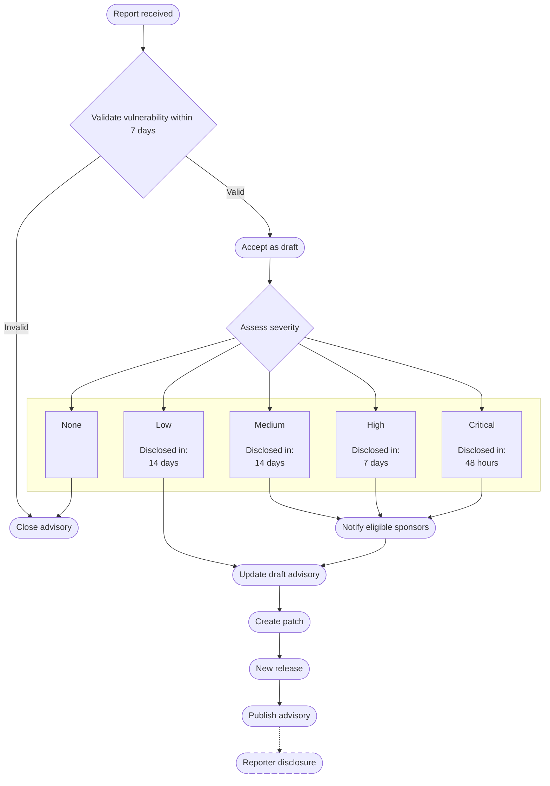

## Pre-Report Checklist

Before you report a vulnerability, first take the following steps:

- Ensure you are using the latest version of ImageMagick [7](https://github.com/ImageMagick/ImageMagick/releases) or [6](https://github.com/ImageMagick/ImageMagick6/releases)
- Attempt to mitigate the vulnerability using a properly curated [security policy](https://imagemagick.org/script/security-policy.php)
  - Verify your policy using the [validation tool](https://imagemagick-secevaluator.doyensec.com/)
  - Confirm that the security policy mitigation steps did not resolve the issue

## Reporting a Vulnerability

 If you have completed the above steps and confirmed that the security policy does not address the vulnerability, report the vulnerability as a [security advisory](https://github.com/ImageMagick/ImageMagick/security/advisories/new). Please include the following information:

- A description of the vulnerability, including the version of ImageMagick affected.
- Steps to reproduce the vulnerability:
  - Operating system and version (e.g., Ubuntu 20.04, Windows 11, macOS 13.2)
  - Compiler information and build configuration (if building from source)
  - Minimal code sample or command line that demonstrates the vulnerability (if applicable)
  - An input file that can be used to demonstrate the vulnerability (if applicable)
-  Any relevant logs or error messages.

# Incident Response Plan 

Once a vulnerability is reported we will take the following steps:

**Note:** The timelines indicated in the incident response plan above are target goals and are not guaranteed. While we will make every effort to meet these timelines, actual remediation dates may vary depending on the complexity of the vulnerability, availability of maintainers, and other factors.